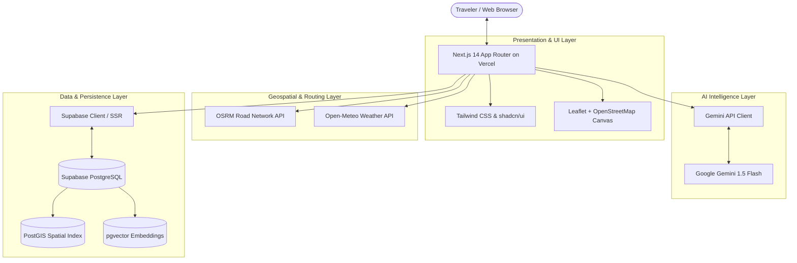

# Rimjhim Roams — System Architecture

Rimjhim Roams (TripWise AI engine) is an AI-powered travel operating system architected for production deployment on Vercel utilizing exclusively high-availability free-tier services.



---

## 1. Core Principles

1. **Zero-Cost Production Tier**:
   - Google Gemini API (Free tier from Google AI Studio)
   - Supabase (Free tier 500MB PostgreSQL with PostGIS & pgvector)
   - Open-Meteo (Free weather API with no key required)
   - OpenStreetMap / OSRM (Free public tiles and routing engine)
   - Vercel (Hobby tier edge & serverless deployments)
2. **Type Safety & Reliability**:
   - Strict TypeScript end-to-end.
   - Decoupled domain models (`src/types/travel.ts`) and database representations (`src/types/database.ts`).
3. **Resilient Fallbacks**:
   - AI service includes scaffolded fallbacks when API keys or network requests fail.
   - Weather and routing services degrade gracefully to preserve UI responsiveness.

---

## 2. Directory Structure

```
Rimjhim Roams/
├── docs/
│   ├── architecture.md       # System design & component contracts
│   └── roadmap.md            # Phased milestone delivery
├── src/
│   ├── app/                  # Next.js App Router
│   │   ├── api/
│   │   │   ├── health/       # Health monitoring endpoint
│   │   │   └── trips/        # AI trip synthesis endpoints
│   │   ├── globals.css       # Tailwind CSS & theme variables
│   │   ├── layout.tsx        # Root HTML layout and metadata
│   │   └── page.tsx          # Landing & discovery interface
│   ├── components/
│   │   └── ui/               # shadcn/ui reusable design system tokens
│   ├── lib/
│   │   ├── gemini/           # Gemini AI API integration
│   │   ├── geo/              # OSRM routing & Open-Meteo weather
│   │   ├── supabase/         # SSR & Browser Supabase clients
│   │   └── utils.ts          # Styling & formatting utilities
│   └── types/
│       ├── database.ts       # Supabase PostGIS + pgvector schema
│       └── travel.ts         # Domain models (Trips, Itineraries, Routes)
├── test/
│   └── health.test.mjs       # Automated health & logic checks
├── .env.example              # Environment variables template
├── next.config.mjs           # Next.js configuration
├── package.json              # Project dependencies & scripts
├── postcss.config.mjs        # PostCSS configuration
├── tailwind.config.ts        # Tailwind theme & token setup
└── tsconfig.json             # TypeScript compiler settings
```

---

## 3. Database & Spatial Schema

- **PostgreSQL**: Stores relational user and itinerary data.
- **PostGIS (`geography(Point, 4326)`)**: Enables indexed radius queries, bounding box spatial filtering, and distance computations without external geospatial APIs.
- **pgvector**: Stores high-dimensional destination vector embeddings for semantic discovery (e.g. matching "peaceful mountain retreat with coffee plantations" to indexed locations).
