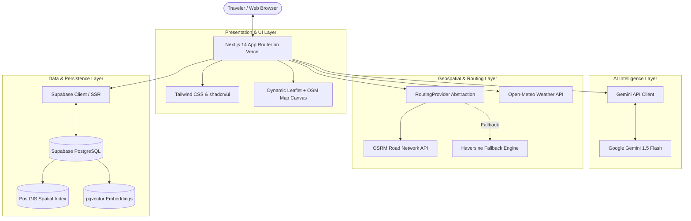

# Rimjhim Roams — System Architecture

Rimjhim Roams (TripWise AI engine) is an AI-powered travel operating system architected for production deployment on Vercel utilizing exclusively high-availability free-tier services.



---

## 1. Core Principles

1. **Zero-Cost Production Tier**:
   - Google Gemini API (Free tier from Google AI Studio)
   - Supabase (Free tier 500MB PostgreSQL with PostGIS & pgvector)
   - Open-Meteo (Free weather API with no key required)
   - OpenStreetMap / OSRM (Free public tiles and routing engine)
   - Vercel (Hobby tier edge & serverless deployments)
2. **Type Safety & Reliability**:
   - Strict TypeScript end-to-end.
   - Decoupled domain models (`src/types/travel.ts`) and database representations (`src/types/database.ts`).
3. **Resilient Fallbacks**:
   - AI service includes scaffolded fallbacks when API keys or network requests fail.
   - Routing service gracefully degrades to Haversine great-circle calculations with mode-adjusted speeds if OSRM is unreachable or times out.
   - Weather services degrade gracefully to historical seasonals.
4. **Clean Server/Client Boundaries**:
   - Leaflet interacts directly with `window` and the DOM. All map components are isolated behind a dynamic client-only boundary (`next/dynamic` with `{ ssr: false }`) and a zero-dependency loading skeleton.
   - Markers use custom inline SVGs (`L.divIcon`) to prevent bundler 404s on default Leaflet PNG assets.

---

## 2. Directory Structure

```
Rimjhim Roams/
├── docs/
│   ├── architecture.md       # System design & component contracts
│   ├── database.md           # Schema diagrams & PostGIS functions
│   └── roadmap.md            # Phased milestone delivery
├── src/
│   ├── app/                  # Next.js App Router
│   │   ├── api/
│   │   │   ├── auth/         # Login, register, logout handlers
│   │   │   ├── destinations/ # Catalog & PostGIS radius queries
│   │   │   ├── geo/          # OSRM routing proxy (/api/geo/route)
│   │   │   ├── health/       # Health monitoring endpoint
│   │   │   ├── profile/      # User profile & preferences
│   │   │   └── trips/        # AI trip synthesis & CRUD endpoints
│   │   ├── dashboard/        # Authenticated user dashboard
│   │   ├── explore/          # Destination catalog & interactive maps
│   │   ├── profile/          # User preferences editor
│   │   ├── trips/            # Trip management & itinerary creation
│   │   ├── globals.css       # Tailwind CSS & Leaflet tile styles
│   │   ├── layout.tsx        # Root HTML layout and metadata
│   │   └── page.tsx          # Landing & discovery interface
│   ├── components/
│   │   ├── map/              # Reusable Leaflet interactive map components
│   │   │   ├── interactive-map.tsx  # Dynamic SSR-safe wrapper
│   │   │   └── map-inner.tsx        # React-Leaflet canvas, markers, polylines
│   │   └── ui/               # shadcn/ui reusable design system tokens
│   ├── lib/
│   │   ├── gemini/           # Gemini AI API integration
│   │   ├── geo/              # RoutingProvider, OSRM & Open-Meteo
│   │   ├── services/         # Travel data & trip management services
│   │   ├── supabase/         # SSR & Browser Supabase clients
│   │   └── utils.ts          # Styling & formatting utilities
│   └── types/
│       ├── database.ts       # Supabase PostGIS + pgvector schema
│       └── travel.ts         # Domain models (Trips, Itineraries, Routes)
├── test/
│   ├── health.test.mjs       # Automated health checks
│   ├── phase1.test.ts        # Auth & Trip CRUD unit tests
│   ├── phase2.test.ts        # Travel catalog & PostGIS tests
│   └── phase3.test.ts        # RoutingProvider & geospatial tests
├── .env.example              # Environment variables template
├── next.config.mjs           # Next.js configuration
├── package.json              # Project dependencies & scripts
├── postcss.config.mjs        # PostCSS configuration
├── tailwind.config.ts        # Tailwind theme & token setup
└── tsconfig.json             # TypeScript compiler settings
```

---

## 3. Geospatial & Routing Architecture

### RoutingProvider Abstraction
The routing engine provides a vendor-neutral contract defined in [`src/lib/geo/routing.ts`](file:///c:/Rimjhim%20Roams/src/lib/geo/routing.ts):
- `calculateRoute(waypoints, mode, options)`: Returns GeoJSON coordinates, distance in meters/km, duration in seconds/minutes, and attribution source (`osrm` or `haversine-fallback`).
- `calculateDistance(origin, destination, mode)`: Computes point-to-point distance.
- `calculateTravelTime(origin, destination, mode)`: Computes estimated travel duration.

### Supported Routing Modes
- **Driving**: Uses OSRM driving profile over the road network (~50 km/h baseline).
- **Walking**: Calibrated for pedestrian travel (~4.5 km/h / 1.25 m/s).
- **Cycling**: Calibrated for urban cycling (~15 km/h / 4.17 m/s).

### Resilience & Fallback Strategy
- Every OSRM fetch incorporates an `AbortController` timeout (default 6 seconds).
- In the event of timeout, invalid external response, or network failure, the provider falls back automatically to great-circle Haversine calculations without throwing unhandled exceptions.
- Coordinate boundaries are strictly validated before making external requests (-90 <= lat <= 90, -180 <= lng <= 180).
