# Rimjhim Roams — System Architecture

Rimjhim Roams (TripWise AI engine) is an AI-powered travel operating system architected for production deployment on Vercel utilizing exclusively high-availability free-tier services.

```mermaid
flowchart TD
    User([Traveler / Web Browser]) <--> NextApp[Next.js 14 App Router on Vercel]

    subgraph Presentation & UI Layer
        NextApp --> Tailwind[Tailwind CSS & shadcn/ui]
        NextApp --> LeafletMap[Dynamic Leaflet + OSM Map Canvas]
        NextApp --> BudgetUI[Budget & Optimization Dashboard]
        NextApp --> ItineraryUI[Time Intelligence & Timeline Dashboard]
    end

    subgraph Time Intelligence Layer
        NextApp --> TimeEngine[TimeEngine]
        TimeEngine --> TimeSlots[Strictly Discrete Time Fields: visit, travel, waiting, buffer]
        TimeEngine --> ScheduleValidator[Feasibility & Overlap Validator]
        TimeEngine --> DayOptimizer[Deterministic Day Optimizer]
    end

    subgraph Deterministic Financial & Budget Layer
        NextApp --> BudgetEngine[BudgetEngine]
        BudgetEngine --> MoneyMath[Integer Minor Units Math]
        BudgetEngine --> Optimizer[Deterministic Optimizer Profiles]
        Optimizer --> Alternatives[Accept / Reject Alternatives Engine]
    end

    subgraph AI Travel Copilot Layer
        NextApp --> CopilotService[CopilotService Orchestrator]
        CopilotService <--> AIProvider[AIModelProvider Abstraction]
        AIProvider <--> GeminiEngine[Google Gemini API]
        AIProvider <--> DeterministicEngine[Deterministic Offline Provider]
        CopilotService --> ToolRegistry[Deterministic Tool Registry: 12 Tools]
        ToolRegistry --> TimeEngine
        ToolRegistry --> BudgetEngine
        ToolRegistry --> RoutingService
        ToolRegistry --> WeatherService
        ToolRegistry --> TripPlannerService
    end

    subgraph Geospatial & Routing Layer
        NextApp --> RoutingService[RoutingProvider Abstraction]
        RoutingService --> OSRM[OSRM Road Network API]
        RoutingService -. Fallback .-> HaversineEngine[Haversine Fallback Engine]
        NextApp --> WeatherService[WeatherService & Cache]
        WeatherService --> OpenMeteo[Open-Meteo Weather API]
    end

    subgraph Travel RAG & Knowledge Layer
        NextApp --> RagService[RagService Ingestion & Retrieval]
        RagService --> Pipeline[Cleaning & Semantic Chunker]
        RagService --> Security[Prompt Injection Defense & Delimiters]
        RagService --> EmbeddingEngine[Gemini text-embedding-004 & Deterministic Fallback]
        RagService <--> PgVector[(Supabase PostgreSQL + pgvector)]
    end

    subgraph Data & Persistence Layer
        NextApp --> SupabaseSSR[Supabase Client / SSR]
        SupabaseSSR <--> Postgres[(Supabase PostgreSQL)]
        Postgres --> PostGIS[(PostGIS Spatial Index)]
        Postgres --> Itineraries[(Itineraries & Items)]
        Postgres --> RouteSegments[(Route Segments)]
        Postgres --> PriceSnapshots[(Price Snapshots)]
        Postgres --> Expenses[(Expenses Ledger)]
        Postgres --> KnowledgeDocs[(knowledge_documents)]
        Postgres --> KnowledgeChunks[(knowledge_chunks with pgvector)]
    end
```



---

## 1. Core Principles

1. **Zero-Cost Production Tier**:
   - Google Gemini API (Free tier from Google AI Studio)
   - Supabase (Free tier 500MB PostgreSQL with PostGIS & pgvector)
   - Open-Meteo (Free weather API with no key required)
   - OpenStreetMap / OSRM (Free public tiles and routing engine)
   - Vercel (Hobby tier edge & serverless deployments)
2. **Time Intelligence & Physical Feasibility**:
   - Every scheduled item maintains discrete: `visit_minutes`, `travel_minutes`, `waiting_minutes`, `buffer_minutes`.
   - These 4 components are NEVER merged internally, preventing impossible itineraries, hidden travel bottlenecks, and schedule collapse.
3. **Deterministic Financial Operations (Non-LLM)**:
   - All budget arithmetic, category allocations, and optimization proposals run deterministically in integer minor units (1 INR = 100 paise).
4. **Clean Server/Client Boundaries**:
   - Leaflet interacts directly with `window` and the DOM behind client-only wrappers (`next/dynamic` with `{ ssr: false }`).

---

## 2. Directory Structure

```
Rimjhim Roams/
├── docs/
│   ├── architecture.md       # System design & component contracts
│   ├── database.md           # Schema diagrams & PostGIS functions
│   └── roadmap.md            # Phased milestone delivery
├── src/
│   ├── app/                  # Next.js App Router
│   │   ├── admin/
│   │   │   └── knowledge/    # Phase 10 Authoritative Knowledge & RAG Playground UI
│   │   ├── api/
│   │   │   ├── admin/
│   │   │   │   └── knowledge/# Phase 10 Knowledge document ingestion & CRUD API
│   │   │   ├── auth/         # Login, register, logout handlers
│   │   │   ├── copilot/      # Phase 9 AI Copilot chat route (/api/copilot/chat)
│   │   │   ├── destinations/ # Catalog, PostGIS radius queries & discovery (/discover)
│   │   │   ├── geo/          # OSRM routing proxy (/api/geo/route)
│   │   │   ├── health/       # Health monitoring endpoint
│   │   │   ├── profile/      # User profile & preferences
│   │   │   ├── rag/          # Phase 10 RAG vector search (/search) and chat (/chat)
│   │   │   └── trips/        # AI trip synthesis, CRUD, /budget, /itinerary, /plan, /weather
│   │   ├── assistant/        # Phase 9 Global AI Travel Copilot UI
│   │   ├── dashboard/        # Authenticated user dashboard
│   │   ├── explore/          # Destination catalog & interactive maps
│   │   ├── profile/          # User preferences editor
│   │   ├── trips/            # Trip management & itinerary creation
│   │   │   └── [id]/
│   │   │       ├── assistant/# Phase 9 Trip-specific AI Copilot UI
│   │   │       ├── budget/   # Phase 4 Budget & Optimization Engine UI
│   │   │       ├── itinerary/# Phase 5 Time Intelligence Timeline UI
│   │   │       ├── weather/  # Phase 8 Weather Intelligence & Conflict Shield UI
│   │   │       └── page.tsx  # Phase 6 Complete Trip Planner Hub
│   │   ├── globals.css       # Tailwind CSS & Leaflet tile styles
│   │   ├── layout.tsx        # Root HTML layout and metadata
│   │   └── page.tsx          # Landing & Phase 7 "FIND WHERE I SHOULD GO" Discovery UI
│   ├── components/
│   │   ├── ai/               # Phase 9 CopilotChat interactive console & tool inspect cards
│   │   ├── discovery/        # Destination Discovery interactive widget
│   │   ├── map/              # Reusable Leaflet interactive map components
│   │   └── ui/               # shadcn/ui reusable design system tokens
│   ├── lib/
│   │   ├── ai/               # AI Model Providers (Gemini, Deterministic) & Tool Registry (12 tools)
│   │   ├── budget/           # BudgetEngine, money precision & optimizer
│   │   ├── time/             # TimeEngine, duration calculation & validation
│   │   ├── geo/              # RoutingProvider, OSRM & Open-Meteo
│   │   ├── rag/              # Phase 10 Cleaning, chunking, 768-dim embeddings & security
│   │   ├── weather/          # WeatherProvider, Open-Meteo & WeatherCacheManager
│   │   ├── services/         # Copilot, RAG, TravelData, Trip, Budget, Itinerary, Planner, Discovery & Weather
│   │   ├── supabase/         # SSR & Browser Supabase clients
│   │   └── utils.ts          # Styling & formatting utilities
│   └── types/
│       ├── ai.ts             # Phase 9 AI Copilot domain & tool schemas
│       ├── rag.ts            # Phase 10 Knowledge documents, chunks & citations
│       ├── budget.ts         # Budget & financial domain types
│       ├── time.ts           # Time intelligence, itinerary & validation types
│       ├── discovery.ts      # Destination discovery query & result types
│       ├── planner.ts        # Phase 6 Complete trip planner types
│       ├── weather.ts        # Phase 8 Weather domain, forecast & conflict types
│       ├── database.ts       # Supabase PostGIS + pgvector schema
│       └── travel.ts         # Domain models (Trips, Itineraries, Routes)
├── test/
│   ├── health.test.mjs       # Automated health checks
│   ├── phase1.test.ts        # Auth & Trip CRUD unit tests
│   ├── phase2.test.ts        # Travel catalog & PostGIS tests
│   ├── phase3.test.ts        # RoutingProvider & geospatial tests
│   ├── phase4.test.ts        # BudgetEngine & optimization tests
│   ├── phase5.test.ts        # TimeEngine & itinerary tests
│   ├── phase6.test.ts        # Complete TripPlannerService tests
│   ├── phase7.test.ts        # DestinationDiscoveryEngine unit & e2e tests
│   ├── phase8.test.ts        # WeatherProvider & itinerary integration tests
│   ├── phase9.test.ts        # AI Copilot 12 tools, authorization & scenario tests
│   └── phase10.test.ts       # Phase 10 pgvector RAG, prompt injection & citation tests
├── supabase/
│   └── migrations/
│       ├── 20241001000000_initial_schema.sql
│       ├── 20241002000000_core_travel_data.sql
│       ├── 20241003000000_budget_and_expenses.sql
│       ├── 20241004000000_time_and_itineraries.sql
│       ├── 20241005000000_weather_snapshots.sql
│       └── 20241006000000_knowledge_rag.sql
├── package.json              # Project dependencies & scripts
├── tailwind.config.ts        # Tailwind theme & token setup
└── tsconfig.json             # TypeScript compiler settings
```

---

## 3. Time Intelligence Engine Architecture

### Non-Combined Time Components
Every schedule block records:
1. `visit_minutes`: Genuine dwell/exploration time inside the POI.
2. `travel_minutes`: Transit duration from the preceding coordinate.
3. `waiting_minutes`: Queuing and ticket line delays based on peak hours.
4. `buffer_minutes`: Traffic and transition contingency pad.

### Feasibility Rules Enforced
- **Attraction Closed**: Blocks scheduled outside operational hours.
- **Insufficient Time**: Visits allocated fewer than minimum viable minutes.
- **Overlapping Activities**: Collision detection between consecutive item windows.
- **Impossible Travel**: Transit requirements exceeding the allocated inter-stop gap.
- **Excessive Daily Schedule**: Waking hours exhaustion or extended periods (>9h) without rest/meals.

---

## 4. Real-Time Itinerary Replanning Architecture ("RE-PLAN MY DAY")

### Engine Flow (`ReplanEngine`)
```text
User Delay / GPS Location / New Time
          │
          ▼
1. Isolate Past/Completed Items (end_time <= currentTime)
          │
          ▼
2. Determine Current Route Origin (GPS coordinates or last completed item)
          │
          ▼
3. Hourly Weather Evaluation (Defer outdoor sights to dry slots or substitute indoor)
          │
          ▼
4. Opening & Closing Hours Check (Drop past-closing POIs; shorten dwell before closing)
          │
          ▼
5. Delay Compression (Compress flexible 90-120m dwells to 60-75m to preserve landmarks)
          │
          ▼
6. Low-Priority Schedule Trimming (Deterministic pruning when day capacity is exceeded)
          │
          ▼
7. Invariant Verification (Discrete visit, travel, waiting, buffer minutes preserved)
          │
          ▼
8. Explainable Diff Generation (Added, Removed, Moved, Shortened, Extended with reasons)
          │
          ▼
9. Exact Budget Delta & Time Allocation Audit
```

### Deterministic Replanning Invariants
- **Non-Destructive Preservation**: Must-visit landmarks and high-priority items are prioritized and preserved whenever feasible through dwell compression rather than outright removal.
- **Separated Time Quotas**: `visit_minutes`, `travel_minutes`, `waiting_minutes`, and `buffer_minutes` are never combined into a single ambiguous number.
- **Explainable Change Rationale**: Every modification in `result.changes` contains a human-readable `reason` citing the exact cause (weather window, closing time, delay compression, or schedule overrun).
- **Floating-Point Immunity**: Budget delta calculations use integer minor currency units to ensure zero arithmetic drift.
