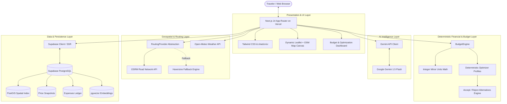

# Rimjhim Roams — System Architecture

Rimjhim Roams (TripWise AI engine) is an AI-powered travel operating system architected for production deployment on Vercel utilizing exclusively high-availability free-tier services.



---

## 1. Core Principles

1. **Zero-Cost Production Tier**:
   - Google Gemini API (Free tier from Google AI Studio)
   - Supabase (Free tier 500MB PostgreSQL with PostGIS & pgvector)
   - Open-Meteo (Free weather API with no key required)
   - OpenStreetMap / OSRM (Free public tiles and routing engine)
   - Vercel (Hobby tier edge & serverless deployments)
2. **Deterministic Financial Operations (Non-LLM)**:
   - All budget arithmetic, cost estimates, category breakdowns, remaining amounts, and over-budget detections are strictly deterministic.
   - All monetary calculations are performed in integer minor units (e.g. paise: 1 INR = 100 paise) to prevent floating-point representation drift (`0.1 + 0.2 != 0.3`).
3. **Resilient Geospatial & Spatial Queries**:
   - Routing service gracefully degrades to Haversine great-circle calculations with mode-adjusted speeds if OSRM is unreachable or times out.
   - PostGIS indexes enable sub-millisecond radius searches.
4. **Clean Server/Client Boundaries**:
   - Leaflet interacts directly with `window` and the DOM. All map components are isolated behind a dynamic client-only boundary (`next/dynamic` with `{ ssr: false }`).

---

## 2. Directory Structure

```
Rimjhim Roams/
├── docs/
│   ├── architecture.md       # System design & component contracts
│   ├── database.md           # Schema diagrams & PostGIS functions
│   └── roadmap.md            # Phased milestone delivery
├── src/
│   ├── app/                  # Next.js App Router
│   │   ├── api/
│   │   │   ├── auth/         # Login, register, logout handlers
│   │   │   ├── destinations/ # Catalog & PostGIS radius queries
│   │   │   ├── geo/          # OSRM routing proxy (/api/geo/route)
│   │   │   ├── health/       # Health monitoring endpoint
│   │   │   ├── profile/      # User profile & preferences
│   │   │   └── trips/        # AI trip synthesis, CRUD & /budget endpoints
│   │   ├── dashboard/        # Authenticated user dashboard
│   │   ├── explore/          # Destination catalog & interactive maps
│   │   ├── profile/          # User preferences editor
│   │   ├── trips/            # Trip management & itinerary creation
│   │   │   └── [id]/
│   │   │       ├── budget/   # Phase 4 Budget & Optimization Engine UI
│   │   │       └── page.tsx  # Trip overview & itinerary inspection
│   │   ├── globals.css       # Tailwind CSS & Leaflet tile styles
│   │   ├── layout.tsx        # Root HTML layout and metadata
│   │   └── page.tsx          # Landing & discovery interface
│   ├── components/
│   │   ├── map/              # Reusable Leaflet interactive map components
│   │   └── ui/               # shadcn/ui reusable design system tokens
│   ├── lib/
│   │   ├── budget/           # BudgetEngine, money precision & optimizer
│   │   │   ├── engine.ts     # Core 9 calculation functions
│   │   │   ├── money.ts      # Integer minor units conversions & math
│   │   │   └── optimizer.ts  # 4 profiles & deterministic alternatives
│   │   ├── gemini/           # Gemini AI API integration
│   │   ├── geo/              # RoutingProvider, OSRM & Open-Meteo
│   │   ├── services/         # Travel data, trip & budget services
│   │   ├── supabase/         # SSR & Browser Supabase clients
│   │   └── utils.ts          # Styling & formatting utilities
│   └── types/
│       ├── budget.ts         # Budget domain, alternative, and expense types
│       ├── database.ts       # Supabase PostGIS + pgvector schema
│       └── travel.ts         # Domain models (Trips, Itineraries, Routes)
├── test/
│   ├── health.test.mjs       # Automated health checks
│   ├── phase1.test.ts        # Auth & Trip CRUD unit tests
│   ├── phase2.test.ts        # Travel catalog & PostGIS tests
│   ├── phase3.test.ts        # RoutingProvider & geospatial tests
│   └── phase4.test.ts        # BudgetEngine & optimization tests
├── supabase/
│   └── migrations/
│       ├── 20241001000000_initial_schema.sql
│       ├── 20241002000000_core_travel_data.sql
│       └── 20241003000000_budget_and_expenses.sql
├── package.json              # Project dependencies & scripts
├── tailwind.config.ts        # Tailwind theme & token setup
└── tsconfig.json             # TypeScript compiler settings
```

---

## 3. BudgetEngine & Financial Precision

### Integer Minor Units Architecture
- All currency operations represent money as integer minor units (`minorUnits: number`, scale = 100).
- For example, ₹20,000 is stored and computed as `2000000` paise.
- Major currency formatting and conversions (`toMinorUnits`, `fromMinorUnits`, `formatCurrency`) are encapsulated in `src/lib/budget/money.ts`.

### Budget Categories
1. `transport`: Inter-city travel (airfares, trains, long-distance buses).
2. `hotel`: Lodging across trip nights and room count.
3. `food`: Dining and daily meals per person.
4. `local_transport`: Intra-city transit (cabs, auto-rickshaws, metro).
5. `activities`: Admissions, park tickets, and guided tours.
6. `shopping`: Retail and souvenir allowances.
7. `emergency_buffer`: Dedicated contingency fund (typically 5% of budget).
8. `other`: Incidentals and miscellaneous expenses.

### 4 Optimization Profiles
- **Budget Saver**: Maximizes financial savings by substituting budget hotels, express trains/buses, and free attractions.
- **Time Saver**: Prioritizes fast transit and geographic route clustering to minimize travel fatigue.
- **Experience Maximizer**: Preserves top-tier culinary experiences and signature attractions while adjusting transit or accommodations.
- **Balanced**: Pragmatic balance of comfort, time, and budget adherence.
