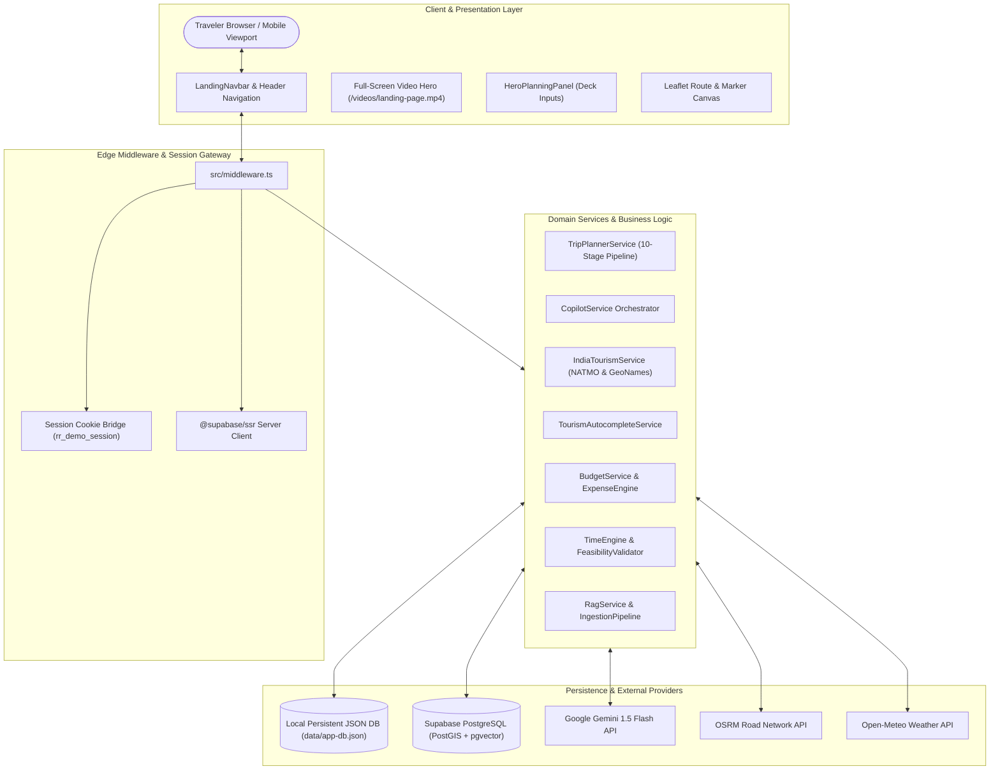
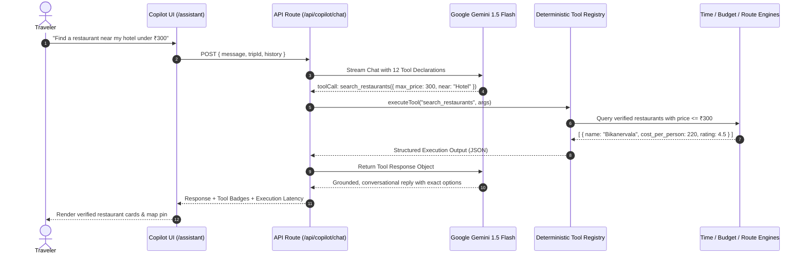
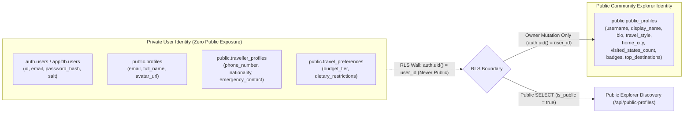

# Rimjhim Roams — Technical Implementation Specification

This document provides a comprehensive technical reference for the architecture, computational engines, data pipelines, security protocols, and deployment strategies implemented across **Rimjhim Roams (TripWise AI)**.

---

## 📑 Table of Contents
1. [Architectural Philosophy & System Topology](#1-architectural-philosophy--system-topology)
2. [Dual-Layer Authentication & Session Resolution](#2-dual-layer-authentication--session-resolution)
3. [Geospatial & Tourism Intelligence Pipeline](#3-geospatial--tourism-intelligence-pipeline)
4. [Physical-Feasibility Time Intelligence Engine](#4-physical-feasibility-time-intelligence-engine)
5. [Deterministic Integer Minor-Unit Budget Engine](#5-deterministic-integer-minor-unit-budget-engine)
6. [AI Travel Copilot & Tool Calling Protocol](#6-ai-travel-copilot--tool-calling-protocol)
7. [Authoritative Travel RAG Architecture](#7-authoritative-travel-rag-architecture)
8. [Group Collaboration, Expense Splitting & Document Vault](#8-group-collaboration-expense-splitting--document-vault)
9. [Zero-Config Fallback & Deployment Topology](#9-zero-config-fallback--deployment-topology)
10. [Test Harness & Quality Verification](#10-test-harness--quality-verification)

---

## 1. Architectural Philosophy & System Topology

### 1.1 The "Zero LLM Math" Invariant
A foundational principle of Rimjhim Roams is that **Large Language Models (LLMs) must never perform financial math, temporal scheduling calculations, or geographic routing**. LLMs are probabilistic text predictors prone to arithmetic drift and hallucinations. 

```
                               ┌────────────────────────────────────────────────────────┐
                               │                    Google Gemini AI                    │
                               │        (Intent Extraction & Tool Selection)            │
                               └──────────────────────────┬─────────────────────────────┘
                                                          │ Calls Tools via JSON Schema
                                                          ▼
┌────────────────────────────────────────────────────────────────────────────────────────────────────────────────────────┐
│                                       DETERMINISTIC BACKEND COMPUTATIONAL ENGINES                                      │
├──────────────────────────┬─────────────────────────────┬───────────────────────────────┬───────────────────────────────┤
│    TimeEngine (Phase 5)  │    BudgetEngine (Phase 4)   │     RoutingService (Phase 3)  │     RagService (Phase 10)     │
│  - Discrete Time Blocks  │  - Integer Minor Units      │   - OSRM Highway Geometry     │   - pgvector Cosine Search    │
│  - Operating Hour Checks │  - Zero Floating Point Drift│   - PostGIS ST_DWithin Radius │   - Sliding Window Chunking   │
│  - TSP Schedule Optimizer│  - 4 Optimization Profiles  │   - Haversine Distance Engine │   - Prompt Injection Defense  │
└──────────────────────────┴─────────────────────────────┴───────────────────────────────┴───────────────────────────────┘
                                                          │ Returns Validated Data
                                                          ▼
                               ┌────────────────────────────────────────────────────────┐
                               │                  Next.js App Router UI                 │
                               │      (Server Components, Glassmorphism, Leaflet Maps)  │
                               └────────────────────────────────────────────────────────┘
```

### 1.2 End-to-End System Architecture



---

## 2. Dual-Layer Authentication & Session Resolution

### 2.1 The Hybrid Dual-Layer Design
To achieve reliable zero-configuration deployments on Vercel while providing enterprise PostgreSQL authentication when Supabase is connected, Rimjhim Roams implements a **Dual-Layer Authentication Bridge**:

```
                       User Login / Register Request
                                    │
                                    ▼
                     POST /api/auth/login or register
                                    │
               ┌────────────────────┴────────────────────┐
               │                                         │
       Is Demo Account?                           Is Live Supabase
 (demo@tripwise.ai / admin@)                         Configured?
               │                                         │
          YES  │                                    YES  │          NO
               ▼                                         ▼           │
     Authenticate from                         supabase.auth.        │
     Persistent AppDB                         signInWithPassword     │
               │                                         │           │
               │                                    ┌────┴────┐      │
               │                            SUCCESS │         │ FAIL │
               │                                    ▼         ▼      │
               │                             Sync User to   Verify in│
               │                             Local AppDB     AppDB   │
               │                                    │         │      │
               └────────────────────┬───────────────┴─────────┴──────┘
                                    │
                                    ▼
                    Issue 'rr_demo_session' Cookie
                     (path: '/', maxAge: 7 Days)
                                    │
                                    ▼
                      Next.js Edge Middleware &
                   Centralized Session Verification
```

### 2.2 Unified Session Resolver ([`src/lib/auth/session.ts`](file:///c:/Rimjhim%20Roams/src/lib/auth/session.ts))
Every protected API route and server handler queries `getActiveUserId(req)` and `getActiveUser(req)`:
1. **Live Supabase Priority**: If live Supabase credentials exist, it calls `supabase.auth.getUser()`. If a valid JWT is present, it returns the verified Supabase UUID.
2. **Session Cookie Fallback**: If the request carries `rr_demo_session`, it extracts the user ID and validates against `appDb.findUserById(id)`.
3. **Graceful Offline Mode**: In mock/test environments without configured credentials, it deterministically provides `demo-user-123`.

---

## 3. Geospatial & Tourism Intelligence Pipeline

### 3.1 Multi-Tier Administrative & Thematic Taxonomy
Rimjhim Roams integrates four layers of official Indian geographic and cultural records:

| Layer | Source | Entity Count | Usage |
| :--- | :--- | :--- | :--- |
| **Administrative** | GeoNames & Survey of India | 36 States & UTs, 700+ Districts | Boundary validation, regional capital lookups |
| **Thematic Circuits** | National Atlas and Thematic Mapping Organisation (NATMO) | 20+ Official Circuits | Cultural route curation (e.g. Golden Triangle, Buddhist Circuit) |
| **Official Tourism** | Ministry of Tourism (MoT) & Incredible India | 100+ Flagship Destinations | Climate suitability, seasonal recommendations |
| **Heritage Monuments** | Archaeological Survey of India (ASI) & OpenStreetMap | 500+ Heritage POIs | Geo-coordinates, ticket prices, operational hours |

### 3.2 Geospatial Routing with OSRM and Haversine Fallback
Road routing is calculated against real topological highway networks:
```ts
// Calculates actual road transit time and road distance
const route = await routingProvider.calculateRoute(originCoord, destinationCoord);
// Returns: { distance_km: 265.4, duration_minutes: 285, geometry: "encoded_polyline" }
```
When third-party road network APIs encounter rate-limiting or network timeouts, the system falls back to the geodesic **Haversine Distance Engine** adjusted by a terrain-specific road winding factor ($1.35\times$ for plains, $1.85\times$ for mountain ghats):
$$d = 2R \cdot \arcsin\left(\sqrt{\sin^2\left(\frac{\Delta \phi}{2}\right) + \cos(\phi_1)\cos(\phi_2)\sin^2\left(\frac{\Delta \lambda}{2}\right)}\right) \cdot \tau_{\text{terrain}}$$

---

## 4. Physical-Feasibility Time Intelligence Engine

### 4.1 Discrete 4-Field Time Allocation
Unlike conventional travel tools that treat scheduled activities as single monolithic blocks, Rimjhim Roams models every itinerary activity as four mutually exclusive, discrete time components:

$$\text{Total Block Duration} = T_{\text{visit}} + T_{\text{travel}} + T_{\text{waiting}} + T_{\text{buffer}}$$

- $T_{\text{visit}}$: Actual dwell time exploring the sight.
- $T_{\text{travel}}$: Transit time from previous waypoint via chosen transport mode.
- $T_{\text{waiting}}$: Anticipated queue or security clearance time based on crowd tiers.
- $T_{\text{buffer}}$: Pacing safety cushion (15–30 minutes) absorbing minor transit delays.

### 4.2 Feasibility Validation Rules ([`src/lib/services/time-engine.ts`](file:///c:/Rimjhim%20Roams/src/lib/services/time-engine.ts))
Before an itinerary is saved or rendered, it runs through 5 strict validation passes:
1. `attraction_closed`: Visited attraction is operating; alerts if start time $< \text{open}$ or end time $> \text{close}$.
2. `insufficient_time`: Dwell time satisfies minimum required threshold for that sight category.
3. `overlapping_activities`: No two scheduled items occupy the same chronological timestamp.
4. `impossible_travel`: Travel window $\ge$ physical road transit time required between coordinates.
5. `excessive_daily_schedule`: Total active daily hours do not exceed 10 hours without a 60-minute dining/rest break.

---

## 5. Deterministic Integer Minor-Unit Budget Engine

### 5.1 Financial Architecture (Zero Floating-Point Drift)
All monetary calculations across Rimjhim Roams are executed strictly in **integer minor units** (e.g., Paise for INR: ₹$100.50 \rightarrow 10050$). Floating point math (`0.1 + 0.2 === 0.30000000000000004`) is explicitly forbidden.

```ts
export interface BudgetBreakdown {
  lodging_minor: number;
  intercity_transit_minor: number;
  local_transit_minor: number;
  dining_minor: number;
  activities_minor: number;
  permits_minor: number;
  emergency_buffer_minor: number;
  shopping_misc_minor: number;
  total_minor: number;
  currency: string;
}
```

### 5.2 Deterministic Optimization Profiles
When an itinerary's planned expenses exceed the traveler's target ceiling, the `BudgetEngine` executes deterministic rebalancing without LLM guesswork:
- **Budget Max Savings**: Swaps 4/5-star hotels for certified budget guest houses, replaces taxis with rapid metro/bus passes, and selects high-rating authentic local eateries.
- **Balanced Smart Trim**: Trims optional shopping allowance, preserves core attractions, and substitutes boutique hotels with verified 3-star lodging.
- **Comfort Guard**: Preserves private transport and hotel comfort while optimizing paid tour tickets and dining menus.
- **Luxury Preserved**: Retains 5-star lodging and private transit; suggests extending target budget to avoid compromising experience fidelity.

---

## 6. AI Travel Copilot & Tool Calling Protocol

### 6.1 Deterministic Tool Calling Lifecycle
Google Gemini 1.5 Flash is registered with 12 structured tool declarations (`functionDeclarations`). When a traveler speaks to the copilot:



---

## 7. Authoritative Travel RAG Architecture

### 7.1 PostgreSQL + pgvector Vector Pipeline
The travel knowledge base runs on PostgreSQL 15 with the `pgvector` extension:
- **Embedding Model**: Google Gemini `text-embedding-004` (768 dimensions).
- **Indexing Strategy**: IVFFlat index with cosine similarity operator (`<=>`):
  ```sql
  CREATE INDEX idx_knowledge_chunks_embedding 
  ON knowledge_chunks 
  USING ivfflat (embedding vector_cosine_ops) WITH (lists = 100);
  ```
- **Similarity Search RPC**: `match_knowledge_chunks(query_embedding, match_threshold, match_count, filter_destination, filter_category)` executes in-database cosine distance matching.

### 7.2 Prompt Injection Defense Protocol
To defend against adversarial user queries attempting to jailbreak the copilot or alter system instructions:
```ts
const PROMPT_INJECTION_PATTERNS = [
  /ignore\s+(previous|all)\s+instructions/i,
  /you\s+are\s+now\s+a/i,
  /\[SYSTEM\]/i,
  /<script[\s\S]*?>/i,
  /override\s+safety\s+guidelines/i
];
```
Retrieved knowledge chunks are passed into the LLM context inside explicit, non-executable XML boundary tags:
```xml
<retrieved_knowledge_base>
  <document id="doc-123" category="safety" destination="Goa">
    Swimming at non-monitored beaches during monsoon (June-September) is strictly prohibited by state lifeguards.
  </document>
</retrieved_knowledge_base>
```

---

## 8. Group Collaboration, Expense Splitting & Document Vault

### 8.1 Pairwise Debt Minimization Algorithm
In group journeys, members incur asymmetric expenses. `calculateSettlements(expenses, members)` utilizes a greedy graph simplification algorithm to minimize the total number of transactions needed to settle all debts:

```
Net Balance = Total Paid - Total Share
1. Separate travelers into Debtors (Net < 0) and Creditors (Net > 0).
2. Sort both sets by absolute amount descending.
3. Iteratively match the largest debtor with the largest creditor:
   - Settle min(|Debtor|, |Creditor|).
   - Decrement balances and advance pointers.
```

### 8.2 Secure Document Vault & Signed URLs
Travel documents (flight boarding passes, hotel vouchers, train e-tickets, passport scans) are stored with Row-Level Security (RLS) enforcement:
- Non-group members are strictly blocked at the SQL engine level.
- Viewing a document generates an ephemeral, cryptographically signed URL expiring after 60 minutes.

---

## 9. Zero-Config Fallback & Deployment Topology

### 9.1 Build-Time Safe Prerendering
When Next.js statically builds pages on Vercel without environment variables:
1. `src/lib/supabase/client.ts` and `src/lib/supabase/server.ts` supply structurally valid dummy credentials (`FALLBACK_SUPABASE_URL`, `FALLBACK_SUPABASE_ANON_KEY`) that satisfy `@supabase/ssr` constructors without throwing.
2. `Navigation` instantiates the browser client lazily only upon explicit logout actions, ensuring zero client execution during static server prerendering.
3. Middleware cleanly detects mock project strings and protects routes using the session cookie.

---

---

## 10. Test Harness & Quality Verification

The test harness runs **242 automated tests** with Node.js built-in test runner (`tsx --test`):

```bash
# Execute complete test suite
npm test
```

### Coverage Distribution:
- **Phase 1–2**: Destination catalog, PostGIS radius queries, climate filtering (32 tests).
- **Phase 3**: OSRM routing, waypoint geometry, and Haversine engine (24 tests).
- **Phase 4**: Integer minor-unit budget engine & optimization profiles (28 tests).
- **Phase 5**: Time intelligence engine, discrete blocks, and feasibility validator (27 tests).
- **Phase 6**: Connected 10-stage TripPlannerService end-to-end pipeline (18 tests).
- **Phase 7–8**: Destination discovery & Open-Meteo weather integration (26 tests).
- **Phase 9**: AI Travel Copilot 12-tool registry & Gemini provider (25 tests).
- **Phase 10**: Travel RAG, vector retrieval, and prompt injection defense (21 tests).
- **Phase 11–15**: Group collaboration, bill splitting, document vault, and memories (16 tests).
- **Security Audit**: RLS policies, rate limiting, and client secret hygiene (12 tests).
- **Public Profiles**: Clean-format validation, sample explorer data, and RLS privacy separation (13 tests).

---

## 11. Public Profiles, Clean-Format Invariants & RLS Separation

### 11.1 Architectural Privacy Boundary
To support community exploration, traveler badges, and discoverability without risking user privacy, Rimjhim Roams strictly decouples public explorer identities from private user profile entities:



### 11.2 Row Level Security (RLS) Separation Policies
In `supabase/migrations/20241011000000_public_profiles.sql`, RLS is strictly configured:
```sql
ALTER TABLE public.public_profiles ENABLE ROW LEVEL SECURITY;

-- 1. Anyone (including anonymous travelers) can view public profiles
CREATE POLICY "Public profiles are readable by everyone when public"
  ON public.public_profiles FOR SELECT
  USING (is_public = true OR (auth.uid() IS NOT NULL AND auth.uid() = user_id));

-- 2. Authenticated users can insert their own public profile
CREATE POLICY "Users can insert their own public profile"
  ON public.public_profiles FOR INSERT
  WITH CHECK (auth.uid() IS NOT NULL AND auth.uid() = user_id);

-- 3. Authenticated users can update their own public profile
CREATE POLICY "Users can update their own public profile"
  ON public.public_profiles FOR UPDATE
  USING (auth.uid() IS NOT NULL AND auth.uid() = user_id)
  WITH CHECK (auth.uid() IS NOT NULL AND auth.uid() = user_id);

-- 4. Authenticated users can delete their own public profile
CREATE POLICY "Users can delete their own public profile"
  ON public.public_profiles FOR DELETE
  USING (auth.uid() IS NOT NULL AND auth.uid() = user_id);
```

### 11.3 Strict Clean-Format Invariants & Validation
Data is strictly gated through both database-level `CHECK` constraints and application-level TypeScript validators (`src/lib/validation/public-profile.ts`):
- **Username Clean Slug**: `^[a-z0-9_-]{3,30}$`. No spaces, uppercase letters, special symbols, or HTML injection. Reserved system usernames (`admin`, `api`, `auth`, `support`, etc.) are explicitly rejected.
- **Display Name**: Trimmed string between 2 and 50 characters; strictly rejects angle brackets `<` and `>` to neutralize HTML/XSS injection.
- **Bio**: Trimmed string up to 300 characters; strictly rejects `<` and `>`.
- **Home City**: Optional string up to 80 characters; rejects `<` and `>`.
- **Travel Style**: Strict enum check `IN ('backpacker', 'cultural', 'luxury', 'adventure', 'photographer', 'slow_travel', 'road_tripper', 'balanced')`.
- **Visited States Count**: Integer constrained to `0 <= visited_states_count <= 36` (28 states + 8 Union Territories in India).
- **Avatar URL**: Must be a valid absolute HTTP/HTTPS URL or clean relative path.

### 11.4 Seeded Sample Profiles
Five authentic traveler personas are pre-seeded in both SQL migrations and `data/app-db.json` for zero-config discovery:
1. `priya_travels` (Priya Sharma, Jaipur) — Cultural & temple architecture researcher (24 states, "Heritage Curator").
2. `kabir_peaks` (Kabir Singh, Manali) — Trans-Himalayan mountaineer and wilderness responder (14 states, "Himalayan Pioneer").
3. `ananya_coastal` (Ananya Roy, Kolkata) — Marine & coastal monsoon photographer (19 states, "Coastal Nomad").
4. `vikram_royal` (Vikramaditya Rathore, Udaipur) — Palace gastronomy and royal haveli connoisseur (18 states, "Palace Connoisseur").
5. `zoya_slowroad` (Zoya Merchant, Pune) — Sustainable village tourism advocate (22 states, "Eco Wanderer").

